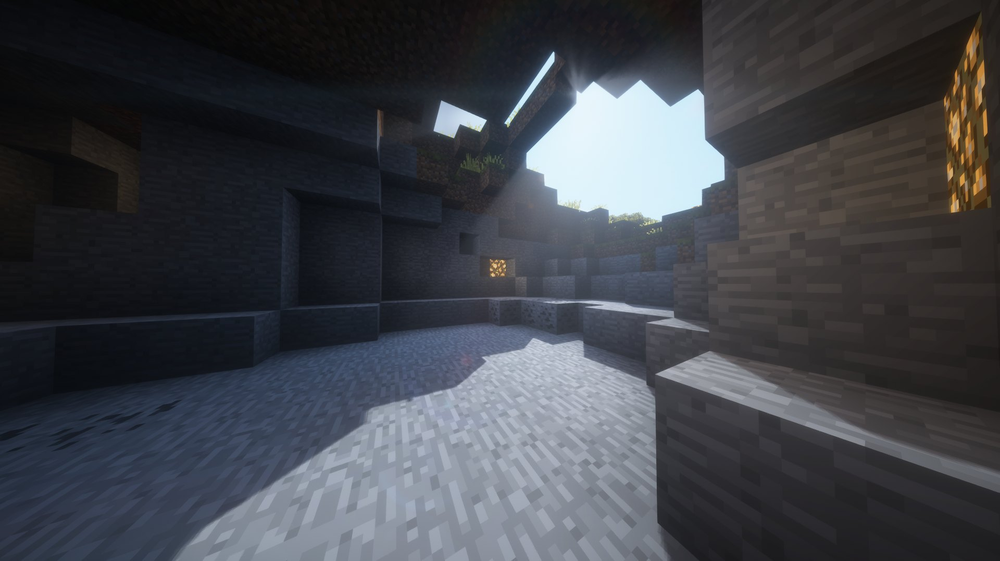
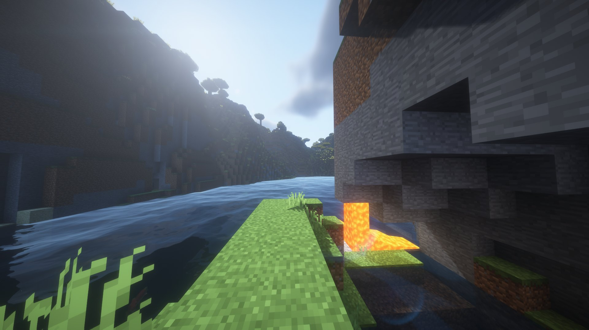

<p align="center">
  
</p>

<h1 align="center">Vitrail</h1>

<p align="center">
  OptiFine-format shader packs, on Minecraft's native Vulkan renderer.
</p>

<p align="center">
  
  
  
  
  
</p>

<p align="center">
  <b>An experiment, and a side project by one person.</b> The Vulkan backend is marked
  experimental by the game itself, and Vitrail does not yet draw the whole frame through your
  pack.<br>
  Packs load and run; they do not yet look entirely like themselves.
</p>

---

<p align="center">
  
</p>
<p align="center">
  <sub>BSL Shaders by Capt Tatsu, running unmodified on the Vulkan backend.</sub>
</p>

<details>
<summary>More screenshots</summary>
<br>
<p align="center">
  
</p>
<p align="center">
  
</p>
</details>

Minecraft 26.2 ships a native Vulkan renderer alongside the OpenGL one. The
shader ecosystem grew up on OpenGL and has not crossed over yet: the packs, the
engines that load them and the habits of the people who write them all assume
that renderer.

Vitrail keeps the two sides compatible while that changes. It loads existing
OptiFine-format packs, unmodified, on the Vulkan backend, so that turning Vulkan
on does not mean giving up the packs you already use.

It is a side project by one person, and it started as a question: whether packs
written for OpenGL over more than a decade could be made to run, untouched, on the
renderer that now ships with the game. The answer turned out to be yes, well enough
to play with. Take it in that spirit - a working experiment, not a product with a
team behind it.

## Status

Experimental, and moving quickly. The core is in place: point Vitrail at a
pack and it loads it, settings and all, translates its programs once, and runs
its frame on the Vulkan backend, in the order the format prescribes. Drawn
through the pack's own programs today: the world's terrain and water, the shadow
map, the overworld sky and its clouds, the weather, the particles, the entities,
which covers the mobs and the block entities alike, and the player's own hand. A
settings screen reads the pack's own menu layout, and a resource pack's normal
and specular maps are served beside the blocks they belong to.

Two limits ride with the last two of those. Entity geometry reaches the pack with
its identifiers held constant - the material id, and the ones naming a mob type, a
block entity type or the item in hand - so a pack that branches on any of them takes
the same branch for every draw and can read a mob as something else entirely. And a
hand holding a translucent block draws that block with a blending pipeline this
engine serves for no family yet, so the arm becomes the pack's while the block it
holds stays the game's.

The glint an enchantment puts over an entity or a held item goes through the
pack as well, with two limits of its own. It is left out of the shadow map, so
what an enchanted thing casts keeps its shape and loses the foil's tint. And
with the game's improved transparency on, the foil of an item that draws one
with blending is handed back to the game, the way the rain and the translucent
particles are.

The End's sky has no answer at all: the overworld's own elements go through the
pack and the End's do not. Neither do the smaller families that stay the game's
inside the entity window, the eyes, the beacon beam and the text of a name
plate. Until all of it goes through the pack, packs run but do not yet look
entirely like themselves. Expect visible differences and rough edges rather than
a finished picture, and expect them to shrink release by release.

That list is what "experimental" means here, and it is worth taking literally: the
picture a given pack produces changes from one release to the next, and it will keep
changing until the whole frame goes through the pack. If what you want today is a
finished picture, use [Iris](https://github.com/IrisShaders/Iris) on the OpenGL
backend instead. It does that job well, and it is the reference this engine is
checked against. Vitrail is for people who want the Vulkan backend on and will
trade image quality for it while that list shrinks.

## Quick start

| Component | Version |
| --- | --- |
| Minecraft | 26.2, running on its Vulkan backend |
| Loader | NeoForge 26.2.0.32-beta or later in the 26.2 line |
| Sodium | 0.9.x for NeoForge |
| Chloride | any 26.2 build, or the Vulkan backend has no window to draw into |

Put the Vitrail jar in `mods/` next to Sodium and Chloride, and switch the game
to Vulkan: `preferredGraphicsBackend:"vulkan"` in `options.txt`, or Options, then
Video Settings, in game. Nothing enforces that switch, though the mod says at
startup which backend the game came up on, and says so as an error when it is not
Vulkan; [INSTALL.md](INSTALL.md) has what its absence looks like, along with the
Chloride settings to turn off. Shader packs go in `shaderpacks/`, as they always
have, and are selected in game from Vitrail's settings screen.

Client only: it does nothing on a server and does not need to be installed on
one. Keep Sodium on 0.9.x, and do not run another shader engine alongside.

To build from source:

```
gradlew build
```

The jar lands in `build/libs`. The details, and the reasons behind the version
pins, are in [INSTALL.md](INSTALL.md).

## How it works

A shader pack is GLSL written against OpenGL conventions that no Vulkan driver
will accept. Vitrail rewrites it: version bump, `varying` and `attribute` into
`in` and `out`, loose uniforms gathered into a block, `gl_FragData[N]` into
outputs declared one per colour attachment, legacy sampler calls, fixed-function
builtins.

That rewriting happens **once, when the pack is loaded**. What reaches the
driver afterwards is SPIR-V, and there is no translation layer left between the
game and the GPU. The distinction matters: this is a compiler that runs at load
time, not a shim that runs per frame.

The SPIR-V itself is not ours. Minecraft already embeds shaderc and SPIRV-Cross,
and its device accepts an arbitrary shader source, so the game does its own
compilation, reflection and binding assignment on our output exactly as it does
on its own shaders.

## Why the OptiFine format

Not because it is elegant, but because that is where the work is. Packs have
been written against the OptiFine conventions for more than a decade, by a lot
of people, and that is still where nearly all of the community writes today.
Minecraft moving to Vulkan does not make any of that work worse. It just makes
it unrunnable, and asking every author to port to a new format is asking them to
throw it away.

So inventing a format was the obvious alternative, and it was rejected on
purpose. Following conventions that have held for ten years means the
specification already exists, there is a corpus of real packs to test against,
and there is an unambiguous definition of done. A new format closes the door on
all three permanently.

It also means an author can keep shipping one pack through the move to Vulkan
rather than maintaining two. None of this rules out supporting a Vulkan-native
format later, if one appears and people write for it; it is simply not the
problem worth solving first.

The cost was measured before any code was written, against a corpus of real,
widely used packs, and development is tested against that corpus continuously.
The packs themselves are not redistributable and are not in this repository.

## Related work

Vitrail is not the first attempt at running shaders on this renderer, and it is
not competing with the projects below.

- **[Iris](https://github.com/IrisShaders/Iris)** is the reference
  implementation for OptiFine-format packs and the reason this project is
  LGPL-3.0 as well. It targets OpenGL, which is where the overwhelming majority
  of packs are still played. Where the format's own documentation runs out,
  Iris is the authority this engine is checked against; the parts adapted from
  it are credited in the licence section below.
- **[Sulkan](https://github.com/mravatins/sulkanShaders)** is an open source
  Vulkan shader engine for Minecraft 26.2 and later, GPLv3, built as a Fabric
  mod. It was already running on the Vulkan renderer when this project started,
  and reading where it hooks into the game was useful. None of its code is
  reused here: its licence would not allow it without relicensing all of
  Vitrail. A mechanical line comparison of the two sources is what keeps that
  claim honest rather than a promise, and it is re-run whenever this engine
  takes on a part of the frame Sulkan also touches.
- **[Aperture](https://github.com/IrisShaders/Aperture-Example-Pack)**, from the
  Iris team, is a newer engine whose packs are written in Slang. Its example
  pack is public. It is a clean break from the OptiFine format rather than a way
  to keep running what already exists.

None of them covers the narrow case this one is built for: a pack written years
ago, running as it is, on the renderer that now ships with the game.

## Compatibility

Vitrail hooks the frame through public NeoForge events where the game offers
them, and through mixins where it does not. The load-bearing ones: the matrices
the world is really drawn with, which are never stored anywhere the camera
exposes; the game's sky renderer, which opens a pass of its own per sky element
and is handed the pack's program for that element, the colour targets the pack
sends it to, and the pack's word on whether that element is drawn at all; and
Sodium's chunk renderer, which is handed the pack's terrain programs, one extra
vertex element carrying the block id, and the render pass its draw buffers
need. Sodium has no API for any of that, which is why its version is pinned.
Every family drawn since takes one or two more, and the whole list is the mixin
config shipped in the jar rather than anything summarised here.

Any mod that unwraps a GPU texture into an OpenGL handle will crash on the
Vulkan backend, with or without Vitrail. Distant Horizons 3.2.0-b does this and
dies on the first frame. This is not something Vitrail can work around.

## Contributing

Open an issue before writing anything substantial. I order the work by risk, and
code that lands ahead of what can be verified is hard to accept however good it
is.

[CONTRIBUTING.md](CONTRIBUTING.md) covers the rest and is short. Two of its rules
bite people who skip it: files are UTF-8 without a BOM everywhere, because a BOM
breaks anything that feeds sources to a GLSL compiler, and line endings are LF.

## Licence

LGPL-3.0-only, in [LICENSE](LICENSE). Version 3 of the Lesser GPL is written as
a set of additional permissions on top of the ordinary GPL rather than as a
standalone document, so a copy of that one is in [GPL-3.0.txt](GPL-3.0.txt) as
well. Both are needed to read either.

Parts of the pack loader and of the value catalogue are adapted from Iris, which
is the reference for what a pack expects. Iris is LGPL-3.0 as well, so nothing
about the licensing of this repository changes. What was taken, from where, and
what was changed on the way is recorded in [NOTICE](NOTICE).
