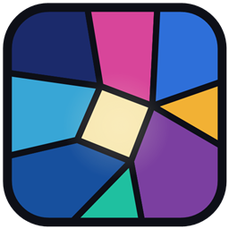

  

<h1 align="center">Vitrail</h1>

  OptiFine-format shader packs, on Minecraft's native Vulkan renderer.

---

Minecraft 26.2 ships a native Vulkan renderer. Shader packs did not follow.
Iris does not run on Vulkan and crashes if it is enabled, and the engines that
do run on Vulkan expect packs written for them, so a decade of existing packs
has nowhere to go.

Vitrail loads those packs unmodified.

## How it works

A shader pack is GLSL written against OpenGL conventions that no Vulkan driver
will accept. Vitrail rewrites it: version bump, `varying` and `attribute` into
`in` and `out`, loose uniforms gathered into blocks, explicit locations,
`gl_FragData[N]` into declared outputs, legacy sampler calls, fixed-function
builtins.

That rewriting happens **once, when the pack is loaded**. What reaches the
driver afterwards is SPIR-V, and there is no translation layer left between the
game and the GPU. The distinction matters: this is a compiler that runs at load
time, not a shim that runs per frame.

The SPIR-V itself is not ours. Minecraft already embeds shaderc and SPIRV-Cross,
and its device accepts an arbitrary shader source, so the game does its own
compilation, reflection and binding assignment on our output exactly as it does
on its own shaders.

## Why the OptiFine format

Inventing a pack format was the obvious alternative and it was rejected on
purpose. Following the OptiFine conventions gives three things that a new format
closes the door on permanently: a specification that has been stable for ten
years, a corpus of real packs to test against, and an unambiguous definition of
done.

The cost is known and measured. Eight packs were surveyed before any code was
written: they expect 274 distinct uniforms between them, and 85 percent of their
1863 compilation units survive a purely mechanical translation. The packs
themselves are not redistributable and are not in this repository.

## Status

Vitrail is being built in order of risk rather than in order of visible payoff.
It does not load a pack yet.

| # | Milestone | State |
| --- | --- | --- |
| 1 | Get a pass of our own into the frame, with GLSL from outside the jar | Done |
| 2 | The pass graph: our own targets, chained, resize-safe | Done |
| 3 | Pack loading: `shaders.properties`, includes, settings, fallbacks | Not started |
| 4 | The translator, ported to Java against the measured corpus | Not started |
| 5 | The uniform surface, where compiling becomes rendering correctly | Not started |
| 6 | Terrain coupling with Sodium | Not started |

Each one has to end in something that can be looked at and judged, rather than
in a claim that it works. Milestone 1 ended with pixels on the screen coming
from a file outside the jar. Milestone 2 ended with a pass reading back what the
pass before it wrote, which is what the next three all rest on.

## Requirements

| Component | Version |
| --- | --- |
| Minecraft | 26.2 |
| Loader | NeoForge 26.2.0.32-beta or later in the 26.2 line |
| Sodium | 0.9.x for NeoForge |

The game also has to be running on its Vulkan backend rather than OpenGL, which
is a setting rather than a dependency: `preferredGraphicsBackend:"vulkan"` in
`options.txt`, or Options then Video Settings in game.

Client only. It does nothing on a server and does not need to be installed on
one. Fabric is not supported: the module exists in the build and is empty, which
is deliberate until NeoForge is proven.

Sodium must stay on 0.9.x. Every shader engine hooks its internals, and it has
no stable API for that.

Build and install instructions are in [INSTALL.md](INSTALL.md).

## Compatibility

Vitrail hooks the frame through a public NeoForge event rather than a mixin, so
at this point nothing reaches into Minecraft or Sodium internals. That will stop
being true at milestone 6, where terrain has to be fed through a pack's own
program and Sodium offers no other way in.

Any mod that unwraps a GPU texture into an OpenGL handle will crash on the
Vulkan backend, with or without Vitrail. Distant Horizons 3.2.0-b does this and
dies on the first frame. This is not something Vitrail can work around.

Do not run another shader engine alongside it.

## Contributing

Open an issue before writing anything substantial. The milestones above are
ordered by risk rather than by how satisfying they are, and work that lands
ahead of its milestone usually cannot be verified yet, which makes it hard to
accept however good it is.

[CONTRIBUTING.md](CONTRIBUTING.md) covers the rest and is short. Two of its rules
bite people who skip it: files are UTF-8 without a BOM everywhere, because a BOM
breaks anything that feeds sources to a GLSL compiler, and line endings are LF.

## Licence

LGPL-3.0-only, in [LICENSE](LICENSE). Version 3 of the Lesser GPL is written as
a set of additional permissions on top of the ordinary GPL rather than as a
standalone document, so a copy of that one is in [GPL-3.0.txt](GPL-3.0.txt) as
well. Both are needed to read either.
