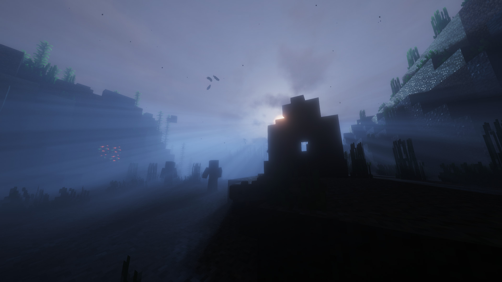
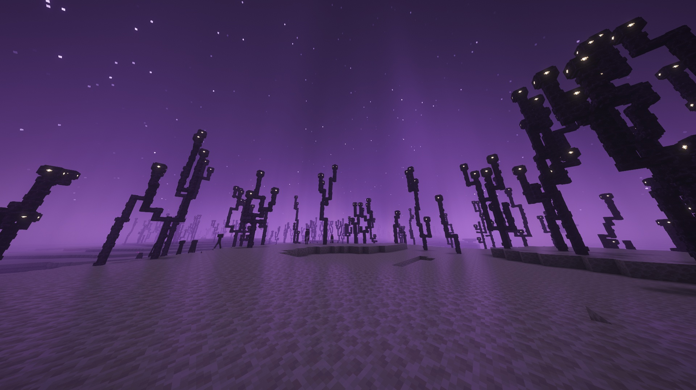
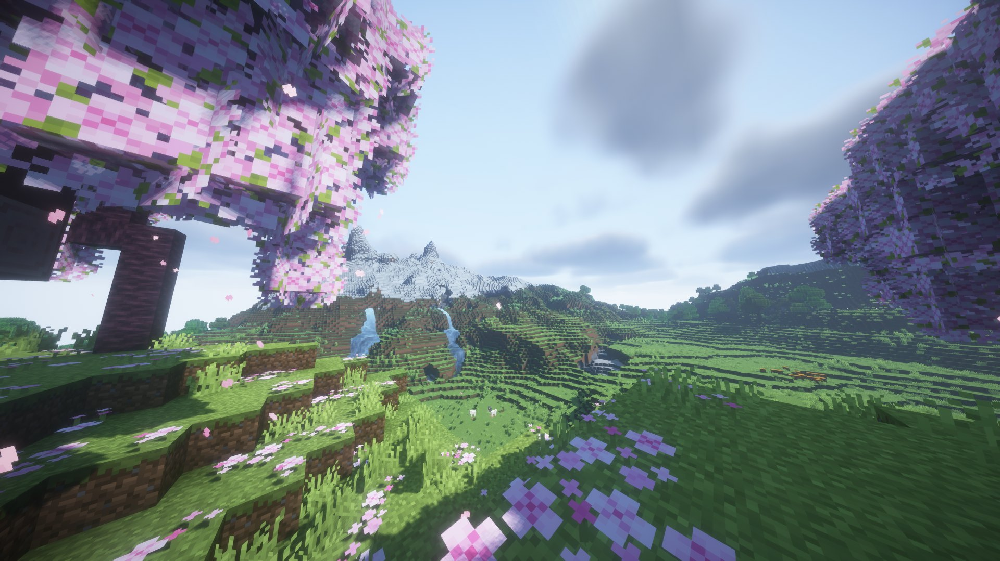
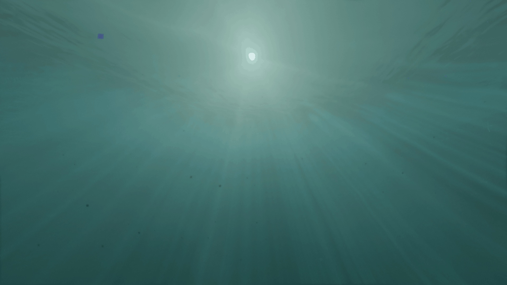

  

<h1 align="center">Vitrail Shaders</h1>

  OptiFine-format shader packs, on Minecraft's native Vulkan renderer.

  
  
  

---

  

  Complementary Shaders, running unmodified on the Vulkan backend.

More screenshots

 

  

  Complementary Shaders.

  

  BSL Shaders.

  

  Bliss Shaders.

Minecraft 26.2 ships a native Vulkan renderer alongside the OpenGL one. Every
shader pack that exists was written for OpenGL, and none of them run on it.

**Vitrail runs them anyway, unmodified.** It reads an OptiFine-format pack out
of `shaderpacks/`, translates its GLSL once when the pack loads, and hands it to
the compiler the game already embeds. Nothing translates while a frame is drawn.

It started as a question, whether packs written for OpenGL over more than a
decade could run untouched on the renderer that now ships with the game. It is
one person's side project, worked on every day since July, and an early one:
the backend it runs on is marked experimental by the game itself.

It is built the way a lot of software gets built now: AI tools do a real share
of the typing and the debugging, and a human decides, tests against real packs
and against Iris, reviews every line and carries the blame for every bug. What
was taken from Iris and from Kroppeb's stareval is credited file by file in
[NOTICE](NOTICE), under the same licence. If any of that matters to you, now you
know. If the mod is useful, there is a coffee link below, and the issues here
are where I answer.

## Quick start

- One jar for Fabric and NeoForge, on Minecraft 26.2. On
  [CurseForge](https://www.curseforge.com/minecraft/mc-mods/vitrail-shaders), on
  [Modrinth](https://modrinth.com/mod/vitrail-shaders) and on every
  [release](https://github.com/avpbynf/Vitrail-Shaders/releases) here.
- Put it in `mods/` next to Sodium. Client only.
- Switch the game to Vulkan, in Options then Video Settings, and restart it.
- Packs go in `shaderpacks/` as they always have, and are picked from Vitrail's
  own settings screen.

[INSTALL.md](INSTALL.md) has the versions this needs, the Chloride settings that
decide what reaches your pack, and what a game that came up on the wrong backend
looks like.

## What goes through your pack

Terrain, water, shadows, sky, clouds, weather, particles, mobs, block entities,
the held hand, and the far terrain of Distant Horizons given a build of that mod
that draws on this backend, which [Other mods](INSTALL.md#other-mods) names. The
settings screen reads the pack's own menu layout, and a resource pack's normal
and specular maps are served beside the blocks they belong to.

The rest still comes from the game, and that set moves from one release to the
next: the engine logs which families do when a place first draws, and
[pack compatibility](docs/compatibility.md) starts from what you are seeing and
names the cause. If what you want today is a finished picture, use
[Iris](https://github.com/IrisShaders/Iris) on the OpenGL backend instead, which
is the reference this engine is checked against.

## Read more

| If you want to | Read |
| --- | --- |
| Know why the format is OptiFine's, and how this sits next to Iris, Sulkan and Aperture | [Why this exists](docs/why.md) |
| Work out why your pack looks wrong, starting from what you see | [Pack compatibility](docs/compatibility.md) |
| See what changed from one version to the next | [CHANGELOG.md](CHANGELOG.md) |
| Install it, and know what it refuses to run beside | [INSTALL.md](INSTALL.md) |
| Understand how any of this works | [The documentation](docs/README.md) |

## Support

## Contributing

Open an issue before writing anything substantial. I order the work by risk, and
code that lands ahead of what can be verified is hard to accept however good it
is.

[CONTRIBUTING.md](CONTRIBUTING.md) opens on the short version, what refuses a first
push, and carries the rest.

## Licence

LGPL-3.0-only, in [LICENSE](LICENSE), with [GPL-3.0.txt](GPL-3.0.txt) beside it
because version 3 of the Lesser GPL is written as permissions on top of the
ordinary GPL rather than as a standalone document.

Parts of the pack loader and of the value catalogue are adapted from Iris, which
is LGPL-3.0 as well. What was taken and what was changed on the way is recorded
in [NOTICE](NOTICE).
